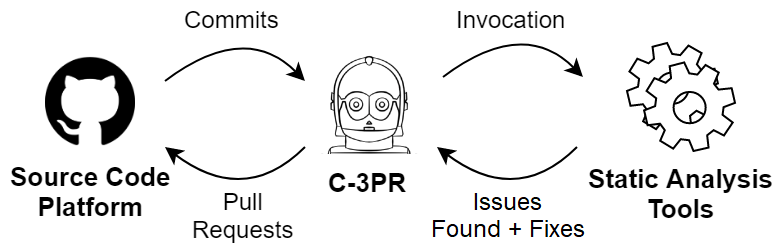
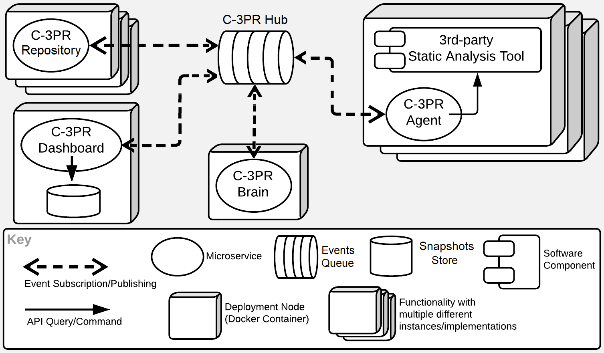
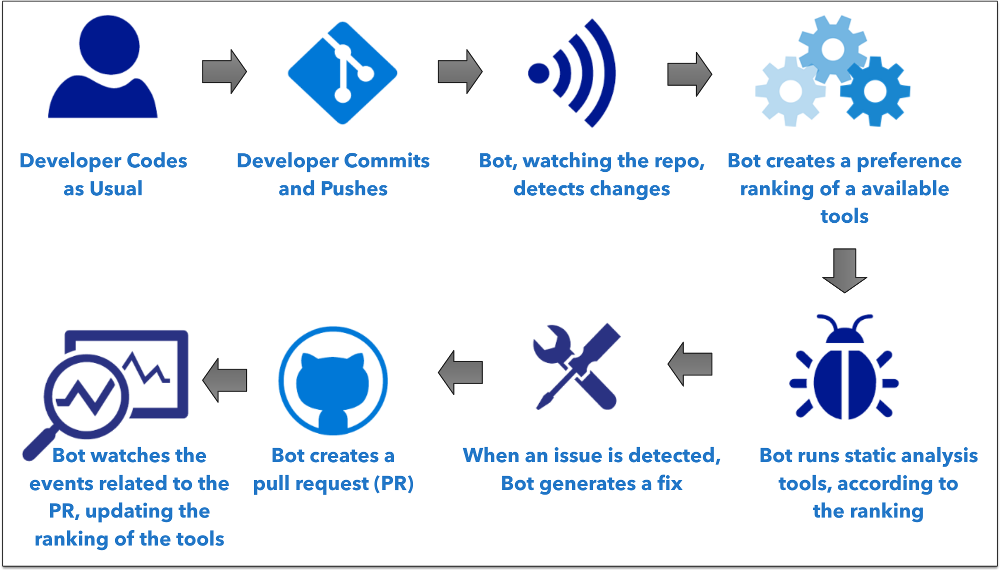

# C-3PR

C-3PR is a static analysis bot. It is part of a Software Engineering research project on [UnB](http://ppca.unb.br/).

The work developed here has been published in the [2020 IEEE 27th International Conference on Software Analysis, Evolution and Reengineering
(SANER)](https://scholar.google.com/citations?view_op=view_citation&hl=pt-BR&user=7_nYmrEAAAAJ&citation_for_view=7_nYmrEAAAAJ:0EnyYjriUFMC).

## C-3PR Main Actors

To automatically generate code fixes and transformations, C-3PR first listens for commit notifications from the source
code platform. Second, it spawns an execution environment for the project and invokes the static analysis tools in the
changed files only. If issues/transformations are found/generated, the bot creates PRs containing the fixes. These PRs
also include descriptions of what issue has been addressed and why.

# Packages/Microservices

C-3PR is a distributed system. Several microservices communicate via an event-driven interface. Other than the dasboard,
which has a dedicated snapshot store, all events in the system are saved as-is, and all the applications (e.g. C-3PR Brain)
work in an event-sourced style.

| Package/Service Name                 | Description                                                  | Port | Travis Build          |
|--------------------------------------|--------------------------------------------------------------|------|-----------------------|
 | c3pr-hub                             | Central Events/Auth registry                                 | 7300 | [![Travis][153]][154] |
| c3pr-brain                           | PR/Projects Intelligence                                     | 7301 | [![Travis][153]][154] |
|                                      |                                                              |      |                       | 
| c3pr-dashboard-ui                    | Centralized UI Frontend                                      | 7305 | [![Travis][153]][154] |
| c3pr-dashboard                       | Centralized UI BFF                                           | 7305 | [![Travis][153]][154] |
|                                      |                                                              |      |                       | 
| node-c3pr-hub-client                 | Reusable lib                                                 | -    | [![Travis][153]][154] | 
| node-c3pr-logger                     | Reusable lib                                                 | -    | [![Travis][153]][154] | 
| node-git-client                      | Reusable lib: Node.js layer on top of shell git command line | -    | [![Travis][153]][154] | 
|                                      |                                                              |      |                       | 
| node-c3pr-repo                       | [x] Reusable functions for repo implementations              | -    | [![Travis][153]][154] | 
| c3pr-repo-github                     | Repo adapter implementation for GitHub                       | 7302 | [![Travis][153]][154] |
| c3pr-repo-gitlab                     | Repo adapter implementation for GitLab                       | 7304 | [![Travis][153]][154] |
|                                      |                                                              |      |                       | 
| c3pr-agent                           | Agent for tool containers                                    | 7303 | [![Travis][153]][154] | 
|                                      |                                                              |      |                       | 
| c3pr-tool-walkmod-sonar              | Tool implementation                                          | 7303 | -                     |
| c3pr-tool-eslint-tslint-custom-rules | Tool implementation                                          | 7303 | -                     |
|                                      |                                                              |      |                       | 
| environment (folder)                 | Scripts for setting up the (dev, prod) environments.         |      |                       | 
| docs (folder)                        | General docs.                                                |      |                       | 

## C-3PR Workflow

[112]: https://hub.docker.com/r/c3pr/c3pr-hub/builds/
[113]: https://travis-ci.org/c3pr/c3pr-hub.svg?branch=master
[114]: https://travis-ci.org/c3pr/c3pr-hub

[122]: https://hub.docker.com/r/c3pr/c3pr-brain/builds/
[123]: https://travis-ci.org/c3pr/c3pr-brain.svg?branch=master
[124]: https://travis-ci.org/c3pr/c3pr-brain

[132]: https://hub.docker.com/r/c3pr/c3pr-dashboard/builds/
[133]: https://travis-ci.org/c3pr/c3pr-dashboard.svg?branch=master
[134]: https://travis-ci.org/c3pr/c3pr-dashboard

[142]: N.A.
[143]: https://travis-ci.org/c3pr/node-c3pr-hub-client.svg?branch=master
[144]: https://travis-ci.org/c3pr/node-c3pr-hub-client
[145]: N.A.

[152]: N.A.
[153]: https://travis-ci.org/c3pr/node-c3pr-logger.svg?branch=master
[154]: https://travis-ci.org/c3pr/node-c3pr-logger
[155]: N.A.

[162]: N.A.
[163]: https://travis-ci.org/c3pr/node-c3pr-git-client.svg?branch=master
[164]: https://travis-ci.org/c3pr/node-c3pr-git-client
[165]: N.A.

[172]: N.A.
[173]: https://travis-ci.org/c3pr/node-c3pr-repo.svg?branch=master
[174]: https://travis-ci.org/c3pr/node-c3pr-repo
[175]: N.A.

[182]: https://hub.docker.com/r/c3pr/c3pr-repo-github/builds/
[183]: https://travis-ci.org/c3pr/c3pr-repo-github.svg?branch=master
[184]: https://travis-ci.org/c3pr/c3pr-repo-github

[192]: https://hub.docker.com/r/c3pr/c3pr-repo-gitlab/builds/
[193]: https://travis-ci.org/c3pr/c3pr-repo-gitlab.svg?branch=master
[194]: https://travis-ci.org/c3pr/c3pr-repo-gitlab

[202]: N.A.
[203]: https://travis-ci.org/c3pr/c3pr-agent.svg?branch=master
[204]: https://travis-ci.org/c3pr/c3pr-agent
[205]: N.A.

[211]: https://github.com/c3pr/c3pr-tool-walkmod-sonar
[212]: https://hub.docker.com/r/c3pr/c3pr-tool-walkmod-sonar/builds/
[213]: N.A.
[214]: N.A.
